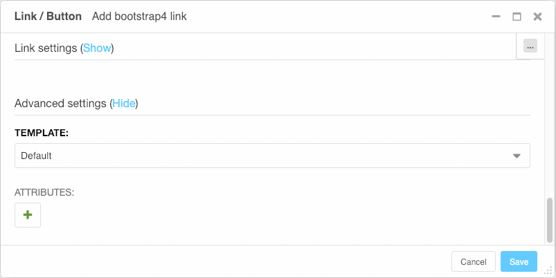

===========================
django CMS Attributes Field
===========================

|pypi| |build| |coverage|

An opinionated implementation of JSONField for arbitrary HTML
element attributes.

This project aims to provide a sensible means of storing and managing
arbitrary HTML element attributes for later emitting them into templates.

There are a wide variety of types of attributes and using the "normal" Django
method of adding ModelFields for each on a business model is cumbersome at
best and moreover may require related tables to allow cases where any number
of the same type of attribute should be supported (i.e., data-attributes).
This can contribute to performance problems.

To avoid these pitfalls, this package allows all of these attributes to be
stored together in a single text field in the database as a JSON blob, but
provides a nice widget to provide an intuitive, key/value pair interface
and provide sensible validation of the keys used.

Contributing
============

This is a an open-source project. We'll be delighted to receive your
feedback in the form of issues and pull requests. Before submitting your
pull request, please review our `contribution guidelines
<http://docs.django-cms.org/en/latest/contributing/index.html>`_.

We're grateful to all contributors who have helped create and maintain this package.
Contributors are listed at the `contributors <https://github.com/divio/djangocms-attributes-field/graphs/contributors>`_
section.

One of the easiest contributions you can make is helping to translate this addon on
`Transifex <https://www.transifex.com/projects/p/djangocms-attributes-field/>`_.

Documentation
=============

See ``REQUIREMENTS`` in the `setup.py <https://github.com/divio/djangocms-attributes-field/blob/master/setup.py>`_
file for additional dependencies:

|python| |django| |djangocms|

Installation
------------

For a manual install:

* run ``pip install djangocms-attributes-field``
* add ``djangocms_attributes_field`` to your ``INSTALLED_APPS``
* run ``python manage.py migrate djangocms_attributes_field``

Configuration
-------------

AttributeField
##############

To use this field in your Models.model: ::

    # models.py
    ...
    from django.db import models
    from djangocms_attributes_field.fields import AttributesField
    ...
    MyCoolModel(models.Model):
        ...
        attributes = AttributesField()

That's it!

There is an optional parameter that can be used when declaring the field: ::

    ``excluded_keys`` : This is a list of strings that will not be accepted as
                        valid keys

property: [field_name]_str
++++++++++++++++++++++++++

``AttributeField`` will also provide a handy property ``[field_name]_str``
that will emit the stored key/value pairs as a string suitable for inclusion
in your template for the target HTML element in question. You can use it
like this: ::

    # models.py
    ...
    MyCoolModel(models.Model):
        ...
        html_attributes = AttributesField()

    # templates/my_cool_project/template.html
    ...
    <a href="..." {{ object.html_attributes_str }}>click me</a>
    ...

(Assuming that ``object`` is a context variable containing a
``MyCoolModel`` instance.)

In addition to nicely encapsulating the boring task of converting key/value
pairs into a string with proper escaping and marking-safe, this property also
ensures that *existing* key/value pairs with keys that have since been added
to the field's ``excluded_keys`` are also not included in the output string.

AttributeWidget
###############

The ``AttributesWidget`` is already used by default by the ``AttributesField``,
but there may be cases where you'd like to override its usage.

The widget supports two additional parameters: ::

    ``key_attrs`` : A dict of HTML attributes to apply to the key input field
    ``val_attrs`` : A dict of HTML attributes to apply to the value input field

These can be useful, for example, if it is necessary to alter the appearance
of the widget's rendered appearance. Again, for example, let's say we needed
to make the key and value inputs have specific widths. We could do this like
so in our ``ModelForm``: ::

    # forms.py

    from django import forms
    from djangocms_attributes_field.widgets import AttributesWidget

    MyCoolForm(forms.ModelForm):
        class Meta:
            fields = ['attributes', ...]

        def __init__(self, *args, **kwargs):
            super(MyCoolForm, self).__init__(*args, **kwargs)
            self.fields['attributes'].widget = AttributesWidget(key_attrs={'style': 'width:250px'},
                                                                val_attrs={'style': 'width:500px'})

Running Tests
-------------

You can run tests by executing::

    virtualenv env
    source env/bin/activate
    pip install -r tests/requirements.txt
    python setup.py test

.. |pypi| image:: https://badge.fury.io/py/djangocms-attributes-field.svg
    :target: http://badge.fury.io/py/djangocms-attributes-field
.. |build| image:: https://travis-ci.org/divio/djangocms-attributes-field.svg?branch=master
    :target: https://travis-ci.org/divio/djangocms-attributes-field
.. |coverage| image:: https://codecov.io/gh/divio/djangocms-attributes-field/branch/master/graph/badge.svg
    :target: https://codecov.io/gh/divio/djangocms-attributes-field

.. |python| image:: https://img.shields.io/badge/python-2.7%20%7C%203.4+-blue.svg
    :target: https://pypi.org/project/djangocms-attributes-field/
.. |django| image:: https://img.shields.io/badge/django-1.11%20%7C%202.2%20%7C%203.0-blue.svg
    :target: https://www.djangoproject.com/
.. |djangocms| image:: https://img.shields.io/badge/django%20CMS-3.4%2B-blue.svg
    :target: https://www.django-cms.org/
